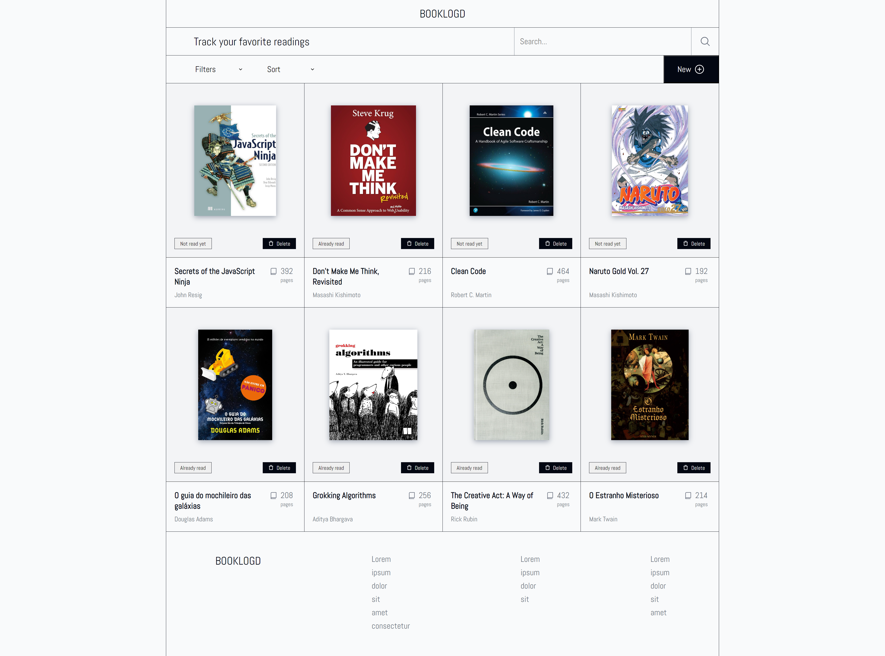

# 

 
 

This Library App is an extension of the “Book” example from the JavaScript course. The goal is to create a small web app that allows users to manage a collection of books by adding, removing, or updating their read status. The project is built using vanilla JavaScript, HTML, and CSS, and demonstrates basic DOM manipulation and event handling techniques.

 Screenshot

  

## 📝 Project Objective

The goal of this project is to develop a basic library management system where users can add, display, and delete books. It enhances my understanding of JavaScript objects, arrays, and DOM manipulation by allowing the creation of dynamic content and interactivity. I’ve implemented a modal-based form for adding books, and various buttons to manage the library (delete books, change their read status, and filter them by status).

This app challenges fundamental front-end skills while reinforcing JavaScript's ability to handle dynamic user inputs and interactions.

## 🔧 Features

- **Add a New Book**: A modal form allows users to input the title, author, number of pages, and whether the book has been read.

- **Dynamic Display**: Books are displayed as cards with cover images, information, and action buttons.

- **Remove Book**: Users can delete books from the library, and the displayed list updates accordingly.

- **Read Status Toggle**: A button on each book card allows users to toggle between “Already read” and “Not read yet” states.

- **Filter Books**: Users can filter books by their read or unread status to organize their library.

## 📖 Learnings

Working on this project helped me:

- **Deepen my understanding of constructors** in JavaScript to create reusable objects for books.

- **Practice DOM manipulation** by dynamically generating HTML content based on user input.

- Learn how to **use event listeners and forms** to capture user input and update the displayed data without reloading the page.

- Understand the importance of **filtering data** and how to implement filtering functionality based on object properties (like read status).

- Explore modal forms and learn how to manage them using **JavaScript and CSS**.

## 💻 Technologies Used

- **JavaScript**: Core functionality and DOM manipulation.

- **HTML**: Structured the app and created elements for the book display and form.

- **CSS**: Styling the interface, including book cards, modals, and form elements.

## 💡 Acknowledgments

- **The Odin Project**: For providing the project outline and guidance.
